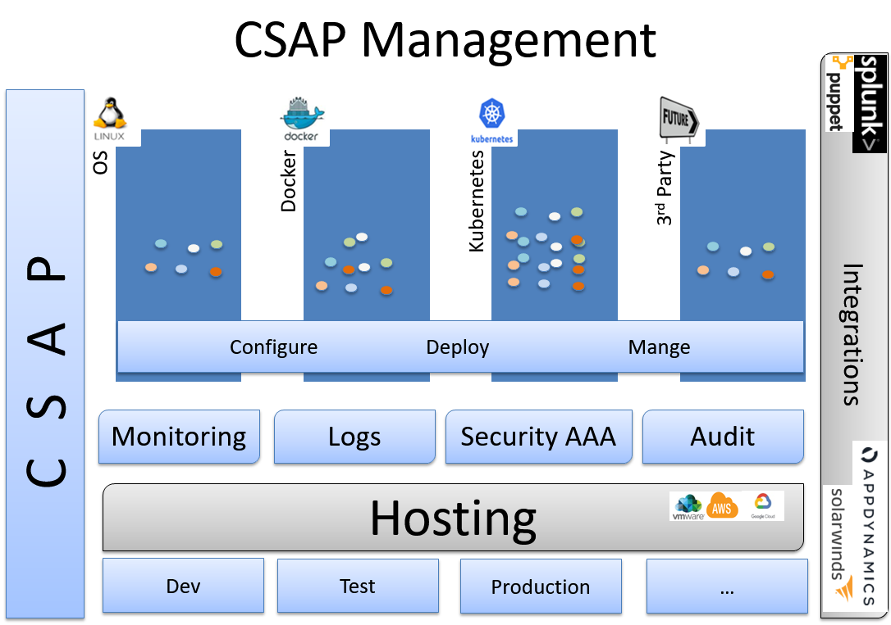

**Documentation: [Csap Wiki](https://github.com/csap-platform/csap-core/wiki)**&nbsp;&nbsp;&nbsp;&nbsp;&nbsp;&nbsp;
_**powered by: [csap-starter](https://github.com/csap-platform/csap-starter/wiki)**_&nbsp;&nbsp;&nbsp;&nbsp;&nbsp;&nbsp;
_**view: [Release Notes](https://github.com/csap-platform/csap-core/wiki/Release-Notes)**_

## High Availablilty: Service Clustering

**projects:**
- csap-core-service: based on spring profile, it provides:
    - management agent: performs collections and deployments on host
    - host portal: provides dashboards
    - application portal: provides application managment
    - analytics portal: provides analytics for multiple applications

