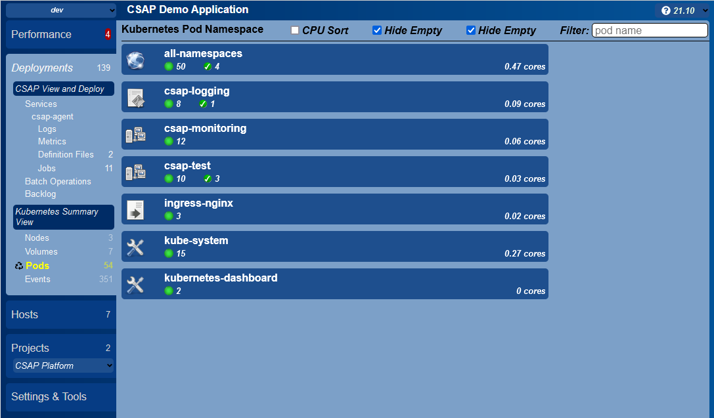
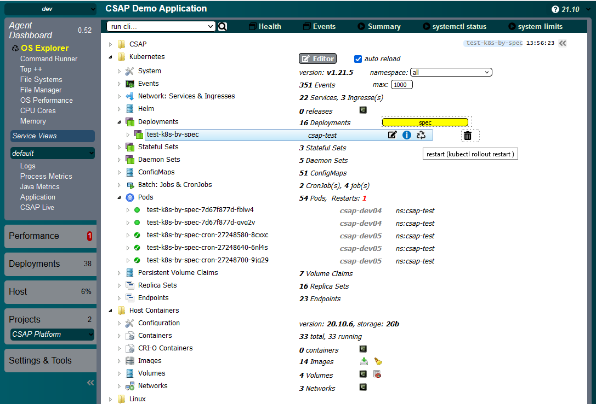
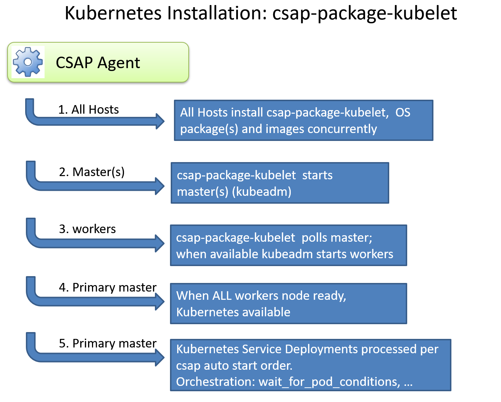

# csap-package-kubelet - overview

[](ghubdocs/kubernetes-summary.png)

The csap-package-kublet is a CSAP Package that provides deployment and operational support for kubernetes. The CSAP Portals provide extensive
[kubernetes integration](https://github.com/csap-platform/csap-core/wiki/Application-Portal#kubernetes). The package includes the following integrations that are tested and released together to ensure compatibility:

- [kubeadm](https://kubernetes.io/docs/reference/setup-tools/kubeadm/)
- [helm](https://helm.sh/)
- [calico networking](https://github.com/projectcalico/calico)
- [kubernetes dashboard](https://github.com/kubernetes/dashboard)
- [kubernetes metric server](https://github.com/kubernetes-sigs/metrics-server)
- [nginx ingress](https://github.com/kubernetes/ingress-nginx)
- [nfs-client-provisioner](https://github.com/kubernetes-incubator/external-storage/tree/master/nfs-client)
- [kubernetes API Access](https://kubernetes.io/docs/concepts/overview/kubernetes-api/)

<div>&nbsp;&nbsp;&nbsp;</div>
<div>&nbsp;&nbsp;&nbsp;</div>
<div>&nbsp;&nbsp;&nbsp;</div>


***
##### Configuration
***

[](ghubdocs/kubernetes-host.png)


All configuration is defined in the [Application Definition](https://github.com/csap-platform/csap-core/wiki/Application-Definition). Key elements:
- configuration maps (definition/my-project.json)
  - *default* environment: typically used for core configation
  -  *derived* environment: typically used for storage settings unique to to a specific deployment. eg. dev, test, prod typically extend default
  
- resource files (definition/resources/kubelet/*): enable the over-ride of any yaml or script provided by this package


<div>&nbsp;&nbsp;&nbsp;</div>
<div>&nbsp;&nbsp;&nbsp;</div>
<div>&nbsp;&nbsp;&nbsp;</div>


***
##### Core Settings
***

[](ghubdocs/kubernetes-install.png)


```json
"kubelet": {
	// the ONLY required parameter, used by kubeadm
	"clusterToken": "xxx.yyy",
	
	// single node enables swap, and deploy on master permitted
	"kubernetesAllInOne": false,
	
	// defaults to latest
	"kubernetesVersion" 1.21.5,
	
	// defaults to public google
	"kubernetesRepo": "http://my-private-repo/media/third_party/kubernetes/kubernetes-el7.repo",
	"masterBackupFolder": "$$nfs-mount/kubernetes-backups/master"
}
```

<div>&nbsp;&nbsp;&nbsp;</div>
<div>&nbsp;&nbsp;&nbsp;</div>
<div>&nbsp;&nbsp;&nbsp;</div>

***
##### Storage Provider: nfs
***

CSAP provides out of box support for nfs as it is the least complicated option for providing support for stateful set services (postgress, mongo, ...). If data services are not required - then storage configuration can be skipped. For example - deployment of micro services that utilize REST apis to access sevices hosted elsewhere.

Reference: https://github.com/kubernetes-sigs/nfs-subdir-external-provisioner

```json
"storage-settings": {
	"$$storage-type": "nfs",
	"$$storage-class": "csap-nfs-storage-1",
	"$$nfs-server": "YOURAPP-SAN-vlan2224NFS.yourcompany.org",
	"$$nfs-path": "/Containerization_NFS/SCS",
	"$$nfs-mount": "/mnt/SCS",
	"$$storage-folder": "scs-dev-platform-storage",
	"$$nfs-sub-folder": "$$csap-environment",
	"$$nfs-provisioner": "kubernetes-pvcs-scs"
}
```

<div>&nbsp;&nbsp;&nbsp;</div>
<div>&nbsp;&nbsp;&nbsp;</div>
<div>&nbsp;&nbsp;&nbsp;</div>

***
##### Ingress: nginx
***

Reference: https://kubernetes.github.io/ingress-nginx/

```json
	"nginx-ingress": {
		"$$ingress-host": "*.xxx.com",
		"$$ingress-node-selector": "\"kubernetes.io/os\": linux",
		"$$ingress-http-port": 7080,
		"$$ingress-https-port": 7443,
		"found-in": [
			"kibana",
			"kubelet",
			"nginx-ingress-controller"
		]
	},
```
